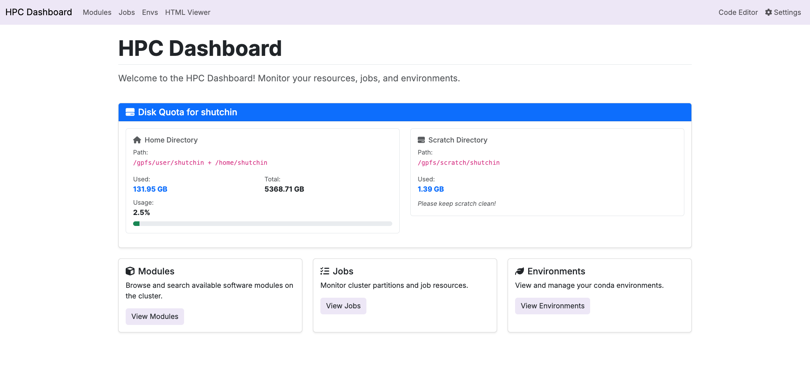

# Open OnDemand HPC Dashboard

A Flask app that serves as a dashboard on the Cheaha HPC cluster, providing an intuitive interface to monitor resources, browse software modules, manage environments, and view cluster status.



## Features

- Browse and search available software modules with category filtering and version management
- Monitor cluster partitions, job resources, and partition availability with real-time status
- View and manage conda environments organized by location (Home, Project, Scratch, etc.)
- View HTML files from whitelisted directories
- Integrated web-based code editor for file editing

## Installation

Create the app directory, clone the repository, and run setup:

```bash
# Create the sandbox apps directory if it doesn't exist for you
# Open OnDemand scans this location for apps
mkdir -p /data/user/$USER/ondemand/dev

# Navigate to the sandbox directory
cd /data/user/$USER/ondemand/dev

# Clone the repository
git clone https://github.com/sdhutchins/ood-hpc-dash.git ood-hpc-dash

# Enter the app directory
cd ood-hpc-dash

# Run setup to create venv and install dependencies
./setup.sh
```

### Explanation of `setup.sh`

Run `setup.sh` to create a virtual environment and install dependencies. The script also creates `bin/python`, which Passenger uses instead of system Python. This ensures Passenger uses your venv's Python with Flask installed.

## Learn More

- [Open OnDemand Documentation](https://osc.github.io/ood-documentation/latest/)
- [Tutorials for Passenger Apps](https://osc.github.io/ood-documentation/latest/tutorials/tutorials-passenger-apps/)
- [App Development Guide](https://osc.github.io/ood-documentation/latest/how-tos/app-development/)
- [Interactive Apps](https://osc.github.io/ood-documentation/latest/how-tos/app-development/interactive/)